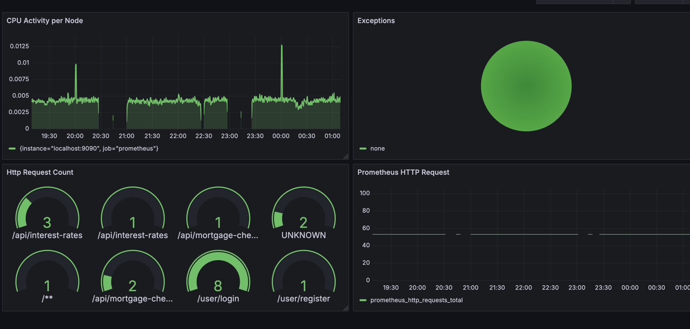

## Mortgage Application
This is an application which can provides the mortgage interest rates based on the period of loan. 
Also with the help of this application you can calculate the feasibility of your mortgage loan and it will provide you with monthly cost.
Only authorise user can access the application. This application also provides you easy access to signup and login.
Following are the list of endpoints which can be used to access features of this application.

#### User Endpoints
Swagger Contract can be found here [Link](./mortgage-contract/src/main/resources/app-user-contract.yaml)

- /user/register (can be used to signup)
- /user/login (can be used to login and get jwt access token)

`User can login with email and password, So application has a unique constraint on email field. The user details are temporarily saved in H2 Database`

### Mortgage Endpoints 
Swagger Contract can be found here [Link](./mortgage-contract/src/main/resources/mortgage-contract.yaml)
 
- /api/interest-rates (Provides the interest rates)
- /api/mortgage-check (Calculates the feasibility of Mortgage)


## Technical Details
This application is build on Spring Boot Framework which uses embedded tomcat server. 
- Java 17
- Spring Boot 3.4.3
- Maven
- Docker

Application also provides metrics which are pushed to prometheus and can be visualised at Grafana dashboard.
The prometheus and grafana images are added in docker-compose.yaml file.


Starting the application.
```
- First checkout and do a maven build. 
- run `docker-compose up -d` command from root directory.
- cd mortgage-service
- run `mvn spring-boot:run`
- Import postman collection from this location [Link](./postman/Mortgage-API.postman_collection.json)
- Since the mortgage endpoints are secured with JWT token. You need to run the postman collection from `User-Login` folder.
- With the login endpoint you get the authToken which will be stored in the postman env variable. This will be automatically added in subsequent calls of mortgage api.
```
To use visualisation go to the Grafana section

The alternate way is to use the shell file ./start.sh present in the root directory. 
Provide the execution right to the ./start.sh and the run it. Following commands are for your rescue. Make sure you are in root directory of the project.

```
chmod +x start.sh
./start.sh
```
the service will be live on Port 1009

The application also has a Dockerfile which can be used to build the docker images of the application. And later the images
can be used to containerize the application.


## Prometheus & Grafana
The application support monitoring, distributed tracing and visualisation via use of tools like Prometheus and Grafana. 

The application pushes all metrics via actuator endpoints. These metrics can be accessed at http://localhost:1009/actuator/prometheus. 
Prometheus scrapes these metrics and the graphs can be accessed at http://localhost:9090/


Further Grafana can use to have a better visualisation. You can access grafana dashboard as follows :-  

- URL : http://localhost:3000/
- Login with : admin/admin
- Don't update the password, you can just skip the next step.
- Now you see the grafana dashboard.
- Click Datasource from left sidebar and add prometheus datasource.
- Since we are using the docker images you need to add : http://host.docker.internal:9090 in prometheus server URL.
- Then click Save & Test.
- The click the Dashboards from left sidebar.
- Click New and then Import
- Now you can import the mortgage dashboard, saved in this project folder at location [Link](./dashboards/Mortgage%20Dashboard-1741783492490.json)
- Now you see a dashboard which gives up CPU Activity, Request Count and exception counts.



## References
#https://spring.io/projects/spring-boot
#https://spring.io/blog/2022/10/12/observability-with-spring-boot-3
#https://docs.spring.io/spring-boot/reference/actuator/metrics.html#actuator.metrics.export.prometheus
